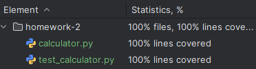

# Fall 2024 SWE 3643 Testing and QA Homework
## Ian McCracken

---

# Homework 1
Create a git repo and a simple unit test.

# Homework 2
1. Converted Pseudocode to Operational Code
   *Converted the pseudocode to operational, well-structured Python*
   [`pseudocode.txt`](assets/pseudocode.txt)
2. Wrote Unit Tests
   *Wrote 11 PyTest unit tests and achieved 100% coverage of every branch*
3. Performed Coverage Analysis
   *Achieved 100% coverage of all branches*
   